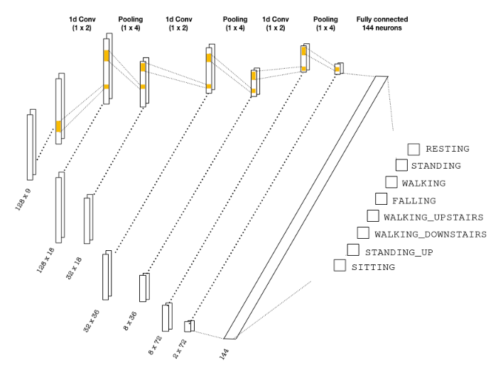

# Human Activity Recognition (HAR)

## Contents

The `utils` folder contains the code for reading and processing the data into a tensor form. The generated tensors
have the dimensions

```
(batch, seq_len, n_channels)
```

where `batch` is the number of training examples in each batch, `seq_len` is the number of steps in the time series (128) and
`n_channels` is the number of channels where observations are made (9). 

The `UCIHAR` folder is our homemade dataset, which follows the same data processing used on the public UCIHAR dataset, and it contains 1150 observations: 1000 of which are used to train the model, and the remaining ones for testing purposes. 

The aim is to classify the activities correctly, which are

```
1 RESTING
2 STANDING
3 WALKING
4 FALLING
5 WALKING_UPSTAIRS
6 WALKING_DOWNSTAIRS
7 STANDING_UP
8 SITTING
```

## Result

Method   | Test accuracy
------   | -------------
CNN      | 94%

## CNN architecture

